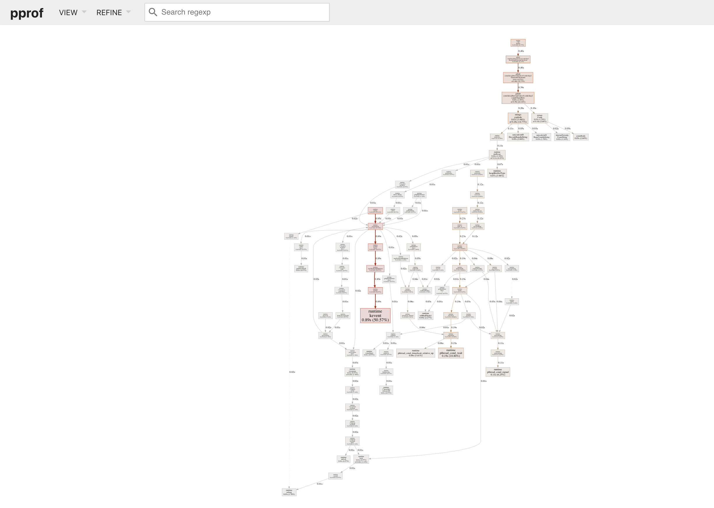
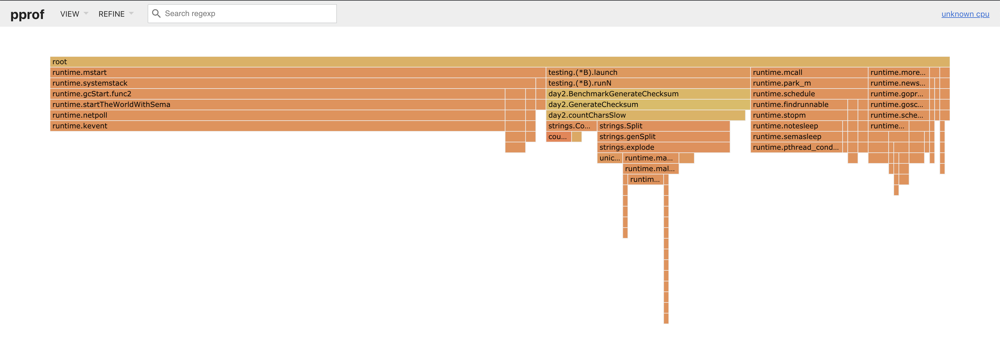
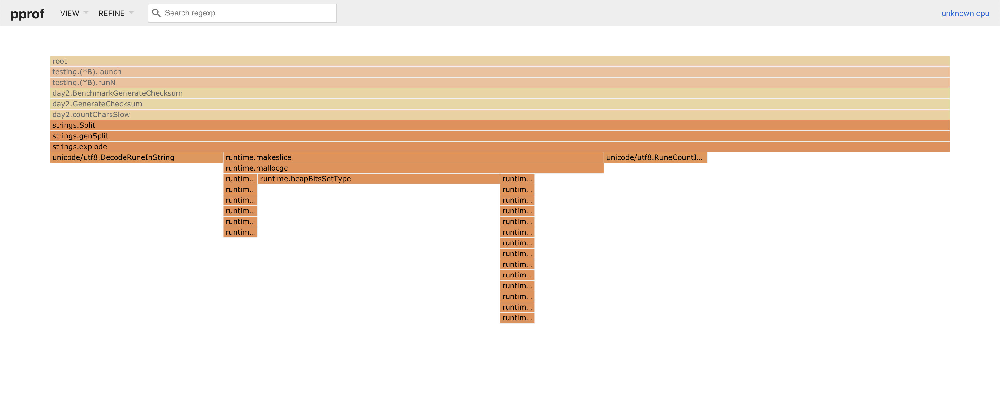

# Performance Analysis

- [Performance Analysis](#performance-analysis)
    - [First iteration](#first-iteration)
    - [Profiling the First Iteration](#profiling-the-first-iteration)
        - [Benchmarks](#benchmarks)
        - [Profiles](#profiles)
        - [pprof web view](#pprof-web-view)
- [Conclusion](#conclusion)
- [Further Reading](#further-reading)

## First iteration

The first iteration was focused on getting the problem completed without much
consideration to performance, this led the implementation to be as follows:

```go
// GenerateChecksum iterates through
func GenerateChecksum(input []string) int {
	var left, right int

	for _, s := range input {
		left += countChars(s, 2)
		right += countChars(s, 3)
	}

	return left * right
}

// countChars iterates through a string and returns 1 if the string contains
// the desired number of duplicates
func countChars(s string, want int) int {
	chars := strings.Split(s, "")

	for _, c := range chars {
		if count := strings.Count(s, c); count == want {
			return 1
		}
	}

	return 0
}
```

This is pretty basic and makes use of the functions within the strings package.
The solution is reasonable (IMO), removes duplication and most importantly it
satisfies the [test cases](./main_test.go).

## Profiling the First Iteration

To dig in more we need to profile the program

### Benchmarks

To see what the performance was like the following benchmark was created:

```go
func BenchmarkGenerateChecksum(b *testing.B) {
	input := []string{
		"oiwcdpbseqgxryfmlpktnupvza",
		"oiwddpbsuqhxryfmlgkznujvza",
		"ziwcdpbsechxrvfmlgktnujvza",
		"oiwcgpbseqhxryfmmgktnhjvza",
	}

	for i := 0; i < b.N; i++ {
		_ = GenerateChecksum(input)
	}
}
```

This is as basic as a benchmark can get using the sample test data from the provided
input.txt

Running the benchmark we get the following results:

```shell
go test -bench=. -benchmem
goos: darwin
goarch: amd64
pkg: github.com/davyj0nes/advent-of-code/day2
BenchmarkGenerateChecksum-4       500000              3383 ns/op            3328 B/op          8 allocs/op
PASS
ok      github.com/davyj0nes/advent-of-code/day2        1.737s
```

The program isn't really doing a lot and to be honest being able to run half a 
million times in less that 2s (most likely 1s as the other test cases needed to run)
is definitely no cause for concern but let's see anyway where the program is spending
it's 3383 ns per opration.

### Profiles

The [pprof tool](https://github.com/google/pprof) allows us tp can get more insight
into what the program is doing and we can use the simple benchmark to generate a profile.

First we'll look at the cpu profile of the program. This can be generated by running:

```shell
go test -bench=. -cpuprofile=cpu.pb.gz
```

We can then open the proile in web browser with:

```shell
pprof -http :6060 day2.test cpu.pb.gz
```

### pprof web view

The first thing we'll see is the call graph and if we zoom out we can see the following:



So there's loads of information here but there's a better view now that Go 1.11.x
has been released.

### Flamegraphs

Flamegraphs are a great way to very quickly understand the call stack of the
application. They were invented by [Brendan Gregg](https://twitter.com/brendangregg)
and he has put some great presentations demonstrating their usefulness as well as
performance engineering in general.
(Also his book [Systems Performance](http://amzn.eu/d/0Q6pWh3) is excellent)

So what does the flamegraph look like for this program.



Digging into the the root of the deepest stack we get



So `strings.Split` is looking like it is makeing quite a few system calls, cache
look ups and memory allocations that haven't been optimised by the compiler.

E

# Conclusion

This is quite a contrived example but does show how easy it is to quickly
profile and analyse the performance of a go program.

Being able to practice these debugging skills is important to writing good applications
and is quite fun to do to get a better understanding of how the packages we use
everyday work.

# Further Reading

Selection of awesome articles by awesome people that allowed me to understand
what I was seeing and interpret the results.

- https://blog.golang.org/profiling-go-programs
- https://dave.cheney.net/2013/06/30/how-to-write-benchmarks-in-go
- https://jvns.ca/blog/2017/09/24/profiling-go-with-pprof/
- https://flaviocopes.com/golang-profiling/
- [Performance Analysis Methodology](https://www.youtube.com/watch?v=abLan0aXJkw)
- [CPU Utilisation is wrong](https://www.youtube.com/watch?v=QkcBASKLyeU)
- [Performance Checklists for SREs](https://www.youtube.com/watch?v=zxCWXNigDpA)

